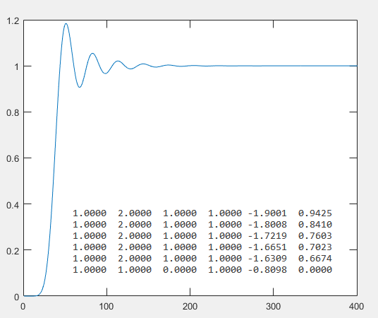

# ButterworthLP
Butterworth lowpass n-th order filter implementation using cascaded second-order sections (SOS).

Resulting SOS is similar to the following MATLAB design: 
<pre>
[z, p, k] = butter(order, cutoffFreq*2*pi, 'low', 's');
[zd, pd, kd] = bilinear(z, p, k, samplingFreq);
[sos, g] = zp2sos(zd, pd, kd);
</pre>
 
 

   
  <i>Step response and SOS matrix of an 11-th order Butterworth lowpass filter</i>

